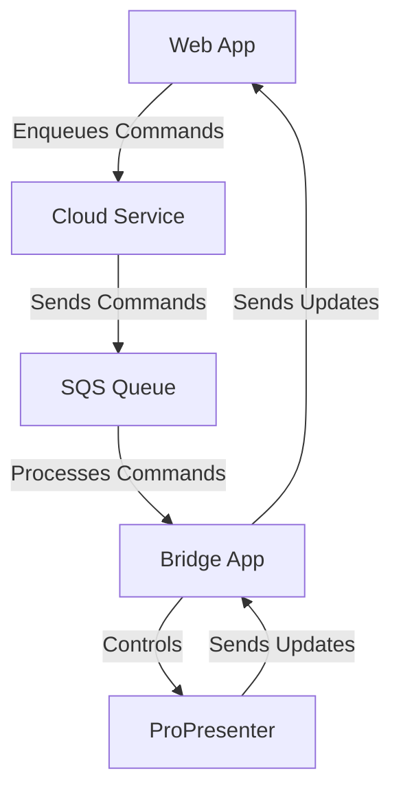
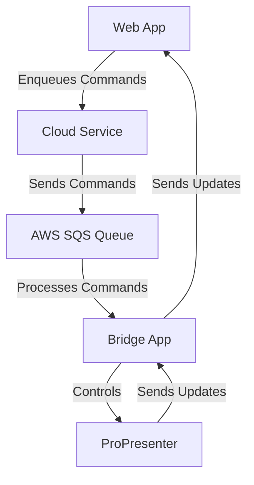

# WorshipBridge

WorshipBridge is a powerful tool designed to enhance the worship experience by seamlessly integrating with ProPresenter. It allows users to control ProPresenter remotely through a web interface, enabling dynamic and interactive presentations during worship services.

## Features

- **Remote Control**: Control ProPresenter from any device with a web browser.
- **Real-time Updates**: See changes in ProPresenter in real-time on the web interface.
- **User Authentication**: Secure access with AWS Cognito authentication.
- **Command Queue**: Reliable command processing with AWS SQS.
- **Modern UI**: Built with Next.js and Tailwind CSS.

## Architecture

WorshipBridge consists of four main components:

1. **Web App** (`web/`): A Next.js application that provides the user interface for controlling ProPresenter.
2. **Cloud Service** (`cloud/`): A Node.js service that handles authentication and command queuing.
3. **Bridge App** (`bridge/`): An Electron application that runs locally and connects to ProPresenter.
4. **Shared Library** (`shared/`): A TypeScript library shared between the Web App and Bridge App.

### Development Flow



### Production Flow



## Development

### Prerequisites

- Node.js (v18 or later)
- Docker and Docker Compose
- ProPresenter installed and running locally

### Setup

1. Clone the repository:
   ```sh
   git clone https://github.com/yourusername/worshipbridge.git
   cd worshipbridge
   ```

2. Install dependencies for each component:
   ```sh
   # Web App
   cd web
   npm install

   # Cloud Service
   cd ../cloud
   npm install

   # Bridge App
   cd ../bridge
   npm install

   # Shared Library
   cd ../shared
   npm install
   ```

3. Start the development environment:
   ```sh
   # Start Docker services
   docker-compose up

   # Start the Bridge App
   cd bridge
   npm start
   ```

4. Open your browser and navigate to `http://localhost:3000` to access the Web App.

## Deployment

### Web App

The Web App is deployed to AWS Amplify. Follow these steps to deploy:

1. Push your changes to the `main` branch.
2. AWS Amplify will automatically build and deploy the Web App.

### Cloud Service

The Cloud Service is deployed to AWS Lambda. Follow these steps to deploy:

1. Build the Cloud Service:
   ```sh
   cd cloud
   npm run build
   ```

2. Deploy to AWS Lambda using the AWS CLI or AWS Console.

### Bridge App

The Bridge App is distributed as a desktop application. Follow these steps to build:

1. Build the Bridge App:
   ```sh
   cd bridge
   npm run build
   ```

2. Distribute the built application to users.

## License

This project is licensed under the MIT License - see the [LICENSE](LICENSE) file for details.

## Acknowledgments

- [ProPresenter](https://renewedvision.com/propresenter/) for their amazing presentation software.
- [Next.js](https://nextjs.org/) for the React framework.
- [Tailwind CSS](https://tailwindcss.com/) for the utility-first CSS framework.
- [AWS](https://aws.amazon.com/) for the cloud infrastructure. 