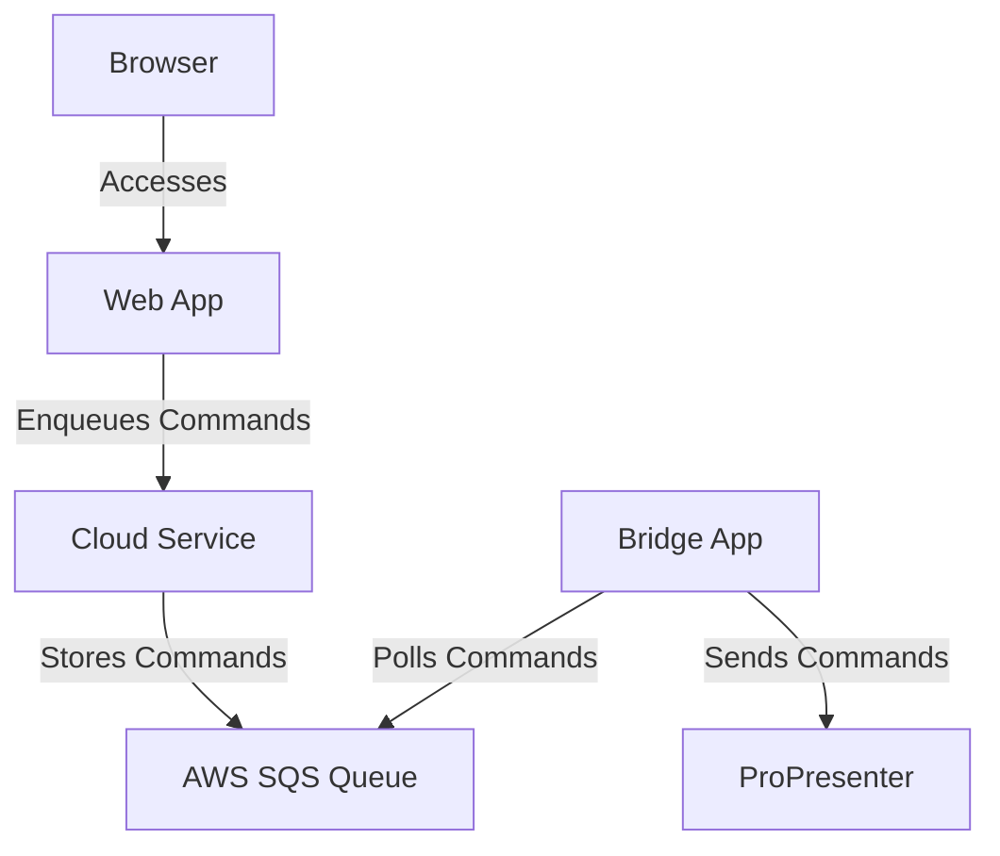
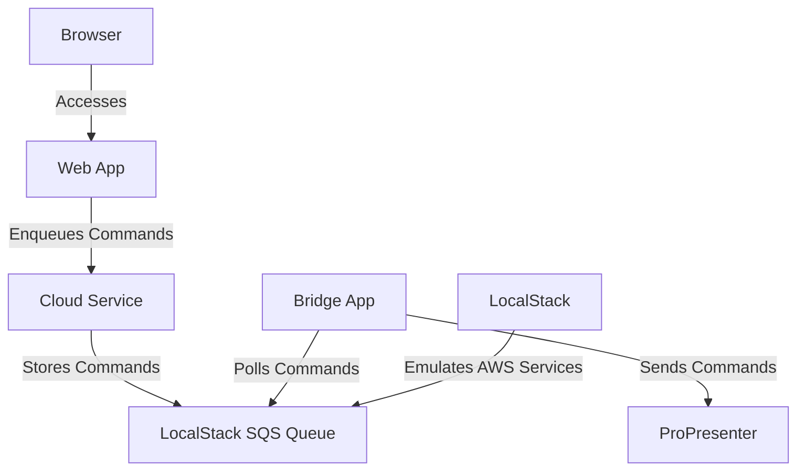

# WorshipBridge

A comprehensive system for remote ProPresenter control, consisting of three main components:

1. **Bridge (Local)**: An Electron-based tray app with a Node.js bridge server that connects to ProPresenter's WebSocket API
2. **Cloud Backend**: An Express.js server integrated with AWS services
3. **Web Dashboard**: A Next.js application for managing playlists and media

## Project Structure

```
worshipbridge/
├── bridge/           # Electron tray app and bridge server
├── cloud/           # Express.js backend with AWS integration
├── web/             # Next.js web dashboard
└── shared/          # Shared TypeScript types and utilities
```

## Prerequisites

- Node.js 18+
- npm or yarn
- AWS Account
- ProPresenter 7
- macOS (for local bridge)

## Development Setup

1. Install dependencies:
   ```bash
   # Install all dependencies (root and components)
   npm run install:all

   # Or install components individually
   npm run install:bridge
   npm run install:cloud
   npm run install:web
   npm run install:shared
   ```

2. Start development servers:
   ```bash
   # Start all components
   npm run dev

   # Or start components individually
   npm run dev:bridge    # Runs on port 3002
   npm run dev:cloud     # Runs on port 3001
   npm run dev:web       # Runs on port 3000
   ```

## Service Ports

When running in development mode, the services use the following ports:
- Web Dashboard: `http://localhost:3000`
- Cloud Backend: `http://localhost:3001`
- Bridge Server: `http://localhost:3002`
- ProPresenter WebSocket: `ws://localhost:5000`

## Available Scripts

### Installation
- `npm run install:all` - Install all dependencies (root and components)
- `npm run install:components` - Install all component dependencies
- `npm run install:bridge` - Install bridge dependencies
- `npm run install:cloud` - Install cloud dependencies
- `npm run install:web` - Install web dependencies

## Shared Package Management

The `shared` directory contains common code used across all components. To ensure consistency and prevent issues:

1. All components must use the local shared package:
   ```json
   {
     "dependencies": {
       "@worshipbridge/shared": "file:../shared"
     }
   }
   ```

2. When modifying the shared package:
   - Update all dependent services to use the new changes
   - Run tests in all components
   - Commit changes to all affected components

3. GitHub Actions will automatically:
   - Check if shared package changes are properly reflected in all components
   - Verify that all components are using the local shared package
   - Ensure no uncommitted changes exist in dependent services

### Workflow Rules

1. **Shared Package Changes**:
   - Must be accompanied by updates in all dependent services
   - Must maintain backward compatibility when possible
   - Must include tests for new functionality

2. **Version Management**:
   - Use semantic versioning for the shared package
   - Update version numbers when making breaking changes
   - Document breaking changes in the changelog

3. **Testing Requirements**:
   - All shared package changes must be tested in all components
   - CI/CD pipeline will verify changes are properly integrated
   - Pull requests must pass all dependency checks

### Building
- `npm run build` - Build all components (shared package first)
- `npm run build:components` - Build all main components
- `npm run build:bridge` - Build bridge component
- `npm run build:cloud` - Build cloud component
- `npm run build:web` - Build web component
- `npm run build:shared` - Build shared package

### Development
- `npm run dev` - Start all components in development mode
- `npm run dev:bridge` - Start bridge in development mode (port 3002)
- `npm run dev:cloud` - Start cloud in development mode (port 3001)
- `npm run dev:web` - Start web in development mode (port 3000)

### Testing
- `npm run test` - Run tests for all components
- `npm run test:components` - Run tests for all main components
- `npm run test:bridge` - Run bridge tests
- `npm run test:cloud` - Run cloud tests
- `npm run test:web` - Run web tests
- `npm run test:shared` - Run shared package tests

### Linting
- `npm run lint` - Lint all components
- `npm run lint:components` - Lint all main components
- `npm run lint:bridge` - Lint bridge component
- `npm run lint:cloud` - Lint cloud component
- `npm run lint:web` - Lint web component
- `npm run lint:shared` - Lint shared package

### Cleaning
- `npm run clean` - Clean all components
- `npm run clean:components` - Clean all main components
- `npm run clean:bridge` - Clean bridge component
- `npm run clean:cloud` - Clean cloud component
- `npm run clean:web` - Clean web component
- `npm run clean:shared` - Clean shared package

### Maintenance
- `npm run reset` - Clean all components and node_modules, then reinstall everything

## Contributing

1. Fork the repository
2. Create a feature branch
3. Install dependencies using `npm run install:all`
4. Make your changes
5. Run tests using `npm run test`
6. Submit a pull request

## License

MIT 

## Architecture

### Production Flow



### Development Flow



### How It Works

1. **Web App**:  
   - Built with Next.js, serves the user interface.
   - Enqueues commands (e.g., create playlist, add slide) to the Cloud Service.

2. **Cloud Service**:  
   - Handles business logic, authentication, and API endpoints.
   - Stores commands in an SQS queue (or LocalStack in development).

3. **SQS Queue**:  
   - Reliably stores commands until they are processed.
   - In production, uses AWS SQS. In development, emulated by LocalStack.

4. **Bridge App**:  
   - A local Electron app that polls the SQS queue for commands.
   - **Does not enqueue commands**—it only processes commands from the queue and sends them to ProPresenter.

5. **ProPresenter**:  
   - Receives commands from the Bridge App and executes them (e.g., creating playlists, adding slides).

6. **Local Development**:  
   - LocalStack emulates AWS services (like SQS) for local testing.
   - The Cloud Service and Bridge App connect to LocalStack instead of real AWS services.

---

## Getting Started

[Your existing setup instructions here...] 